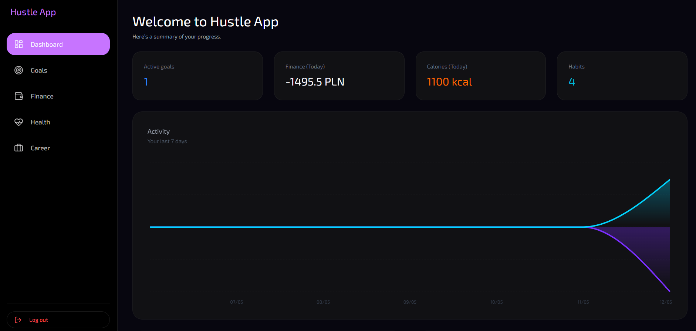
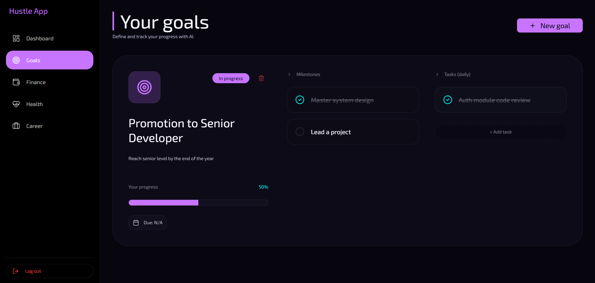
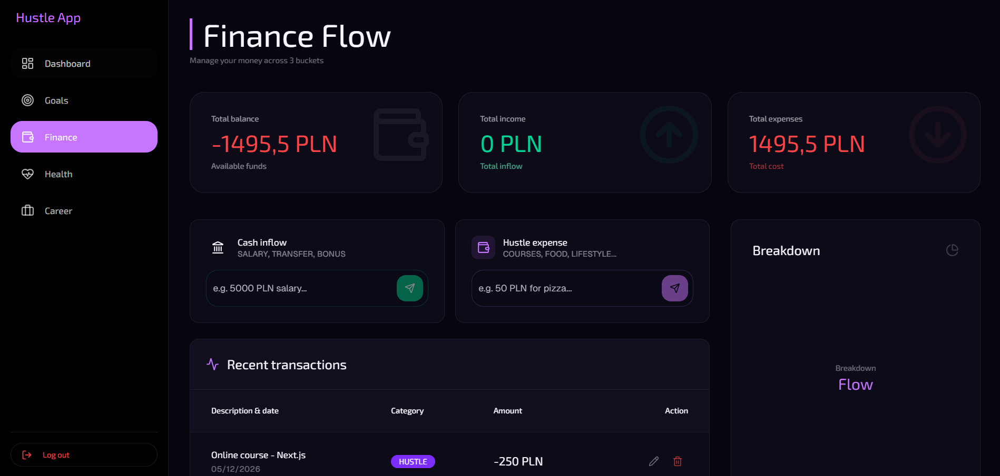
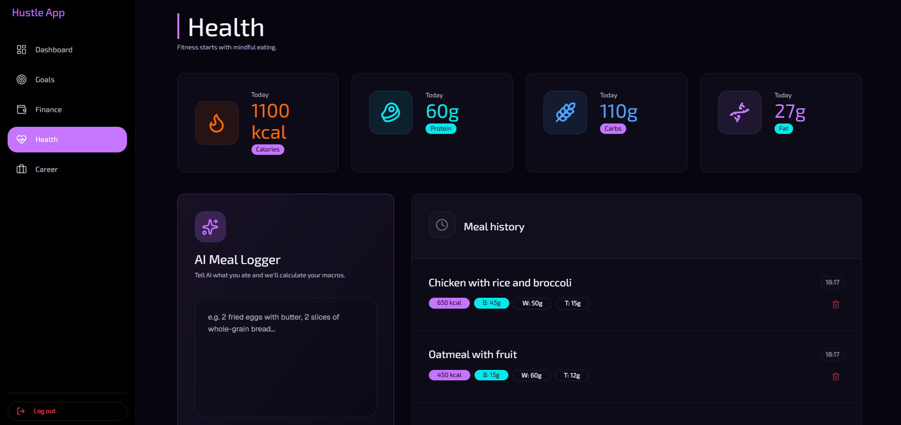
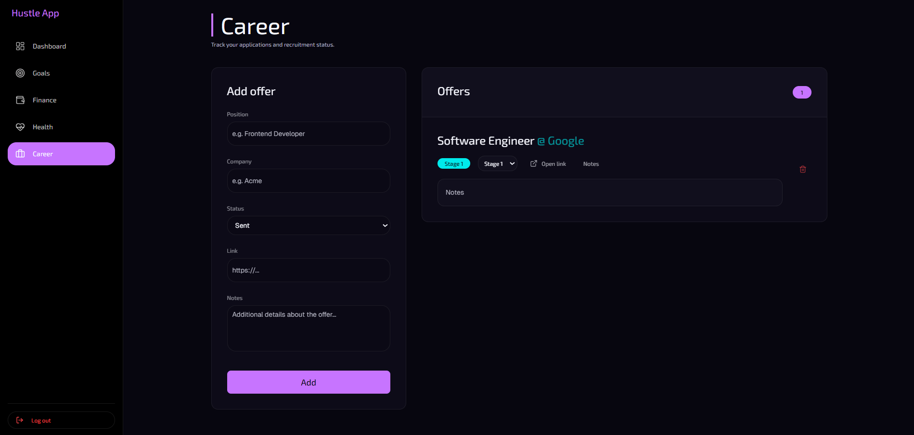

# Hustle App

A full-stack **life-tracking productivity platform** that unifies goals, finances, health, and career in one place — with AI-powered natural language input so logging data takes seconds, not minutes.

**Live demo:** [hustle-app-theta.vercel.app](https://hustle-app-theta.vercel.app) &nbsp;·&nbsp; **API docs:** [backend-hustle-app.onrender.com/docs](https://backend-hustle-app.onrender.com/docs)

---


---

## Features

### Dashboard
Single-screen daily overview — today's tasks, habits, financial balance, calories, active goals, and an AI insight card. Data is served from an in-memory cache (30 s TTL) invalidated on every write, and 8 backend queries fire concurrently via `asyncio.gather`.



### Goals
Create goals with milestones and tasks. **AI Smart-Create** — describe an idea in plain text and get a full OKR (title, description, milestones, tasks) generated automatically via Groq `llama-3.3-70b-versatile`.



### Finances
Track income and expenses across four categories (`OPLATY`, `HUSTLE`, `LIFESTYLE`, `INCOME`). **Hustle Input** — type a sentence like _"50 PLN coffee and lunch"_ and AI extracts the amount, category, and description. CSV export included.



### Health
**AI Meal Logger** — describe what you ate and AI returns calories, protein, carbs, and fat. Full paginated macro history with CSV export.



### Career
Kanban-style job offer tracker — company, role, status pipeline (`wysłano → 1 etap → 2 etap → 3 etap → umowa`), salary range, application date, and notes.



### Auth
- JWT access tokens (60 min) + refresh tokens (30 days) stored as `httpOnly`, `Secure`, `SameSite=none` cookies
- Dual-cookie pattern: `token` (backend domain) + `frontend_token` (Vercel domain) stay in sync
- Demo mode: one-click login with pre-filled seed data; reset runs in the background so login is instant

---

## Tech Stack

| Layer | Technology |
|---|---|
| **Frontend** | Next.js 16 (App Router), React 19, TypeScript, Tailwind CSS v4, shadcn/ui, TanStack Query v5 |
| **Backend** | FastAPI (async), SQLAlchemy 2.x + asyncpg, Alembic |
| **Database** | PostgreSQL (Neon) |
| **AI** | Groq API — `llama-3.3-70b-versatile` |
| **Auth** | JWT (HS256) + httpOnly cookies + sliding refresh tokens |
| **Monitoring** | Sentry (backend + frontend), structured JSON logs |
| **Deploy** | Render.com (backend, Docker) · Vercel (frontend) |
| **CI/CD** | GitHub Actions — lint → typecheck → security scan → tests on every push |

---

## Architecture

```
hustle-app/
├── backend/
│   └── app/
│       ├── api/v1/endpoints/   — Thin FastAPI routers (validate → service → return)
│       ├── models/             — SQLAlchemy ORM models (soft-deletable via SoftDeleteMixin)
│       ├── schemas/            — Pydantic v2 (validation at the boundary)
│       ├── services/           — Business logic: auth, goal, finance, health, ai, demo
│       ├── core/               — Config (pydantic-settings), JWT, rate limiter, TTL cache
│       └── db/                 — Async engine, session factory, mixins, pagination helper
└── frontend/
    ├── app/(dashboard)/        — Next.js App Router pages
    ├── components/             — Presentational UI components (shadcn/ui base)
    ├── hooks/                  — TanStack Query hooks (useDashboard, useGoals, useHealth, …)
    ├── lib/api.ts              — Axios instance with 401 interceptor
    ├── proxy.ts                — Route guard + CSP nonce + security headers (replaces middleware.ts)
    └── types/                  — Auto-generated from OpenAPI schema + named aliases
```

**Key design decisions:**
- All DB aggregations happen in SQL (`func.sum(case(...))`) — never Python loops over rows
- Dashboard fetches 8 independent queries simultaneously with `asyncio.gather`
- `selectinload()` on every relationship — no lazy loading in async context
- Indexes on every `user_id` FK and hot `WHERE` / `ORDER BY` column
- Services are HTTP-free: never import `fastapi`/`HTTPException` — raise `DomainError` subclasses instead

---

## Running Locally

### Prerequisites

- Node.js 18+
- Python 3.11+
- PostgreSQL (local or remote)

### Backend

```bash
cd backend
python -m venv venv
source venv/bin/activate       # Windows: venv\Scripts\activate
pip install -r requirements.txt
cp .env.example .env           # fill in DATABASE_URL, SECRET_KEY, GROQ_API_KEY
alembic upgrade head
uvicorn app.main:app --reload
```

API root: `http://localhost:8000`  
Interactive docs: `http://localhost:8000/docs`

### Frontend

```bash
npm install
cp .env.example .env.local     # set NEXT_PUBLIC_API_URL=http://localhost:8000/api/v1
npm run dev
```

App: `http://localhost:3000`

---

## Environment Variables

### Backend (`backend/.env`)

| Variable | Required | Description |
|---|---|---|
| `DATABASE_URL` | yes | PostgreSQL connection string (`postgresql://…` auto-converted to asyncpg) |
| `SECRET_KEY` | yes | JWT signing secret — minimum 32 chars (enforced by validator) |
| `GROQ_API_KEY` | yes | Groq API key for AI features |
| `DB_SSL` | no | Enable SSL for DB connection (default: `true`) |
| `SENTRY_DSN` | no | Sentry DSN for error tracking |
| `BACKEND_CORS_ORIGINS` | no | Comma-separated allowed origins (defaults to Vercel + localhost:3000) |

### Frontend (`.env.local`)

| Variable | Required | Description |
|---|---|---|
| `NEXT_PUBLIC_API_URL` | yes | Backend API base URL (e.g. `http://localhost:8000/api/v1`) |

> **Never commit secrets.** Update `.env.example` whenever you add a required variable.

---

## API Reference

All routes are prefixed with `/api/v1`.

| Domain | Endpoints |
|---|---|
| Auth | `POST /auth/register`, `/auth/login`, `/auth/refresh`, `/auth/logout`, `/auth/demo-login` · `GET /auth/me` |
| Goals | CRUD on `/goals/` · `POST /goals/smart-create` (AI) · `GET /goals/dashboard/today` · `GET /goals/activity/history` |
| Finance | CRUD on `/finance/expenses` · `POST /finance/hustle-input` (AI) |
| Health | `GET /health/meals` · `POST /health/log-meal-ai` (AI) · `DELETE /health/meals/{id}` |
| Career | CRUD on `/offers` |
| Export | `GET /export/expenses.csv` · `GET /export/meals.csv` |

Full interactive spec: [backend-hustle-app.onrender.com/docs](https://backend-hustle-app.onrender.com/docs)

---

## CI/CD

Every push to `main` and every PR runs:

**Backend** — `ruff check .` → `mypy app` → `bandit -r app -ll` → `pip-audit -r requirements.txt` → `pytest --cov=app`

**Frontend** — `eslint` → `tsc --noEmit` → `next build`

### Run CI checks locally

```bash
# Backend
cd backend
ruff check .
mypy app --ignore-missing-imports
bandit -r app -ll
pip-audit -r requirements.txt
pytest -v --cov=app --cov-report=term-missing

# Frontend
npm run lint
npx tsc --noEmit
npm run build
```

---

## Author

Built by [Devemite](https://devemite.vercel.app)
